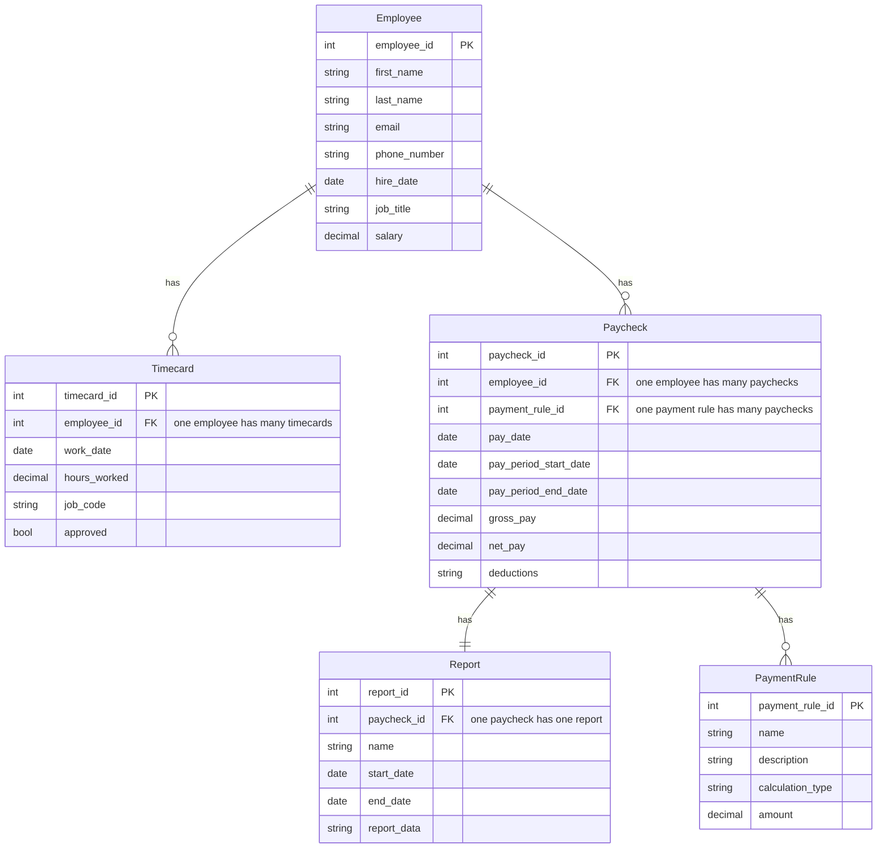
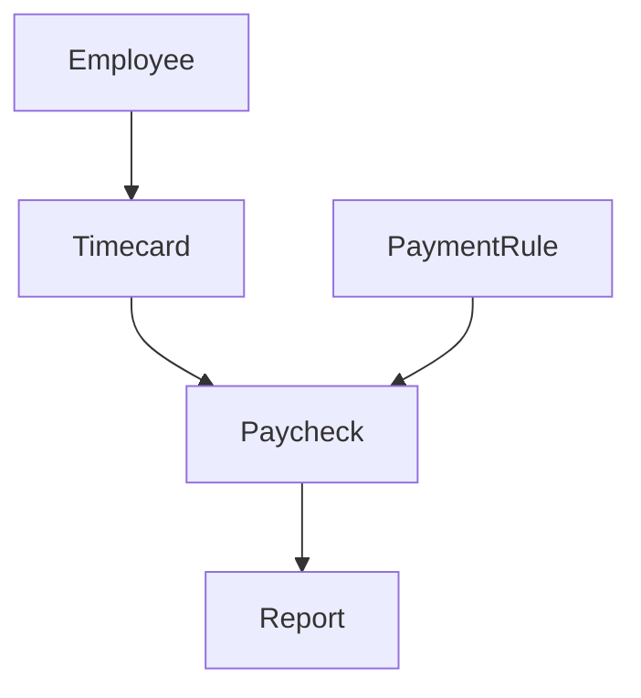

**Employee Entity**

| **Field**    | **Type** | **Description**                    |
|--------------|----------|------------------------------------|
| employee_id  | Integer  | Unique identifier for the employee |
| first_name   | String   | First name of the employee         |
| last_name    | String   | Last name of the employee          |
| email        | String   | Email address of the employee      |
| phone_number | String   | Phone number of the employee       |
| hire_date    | Date     | Date the employee was hired        |
| job_title    | String   | Job title of the employee          |
| salary       | Decimal  | Base salary of the employee        |

**Timecard Entity**

| **Field**    | **Type** | **Description**                                      |
|--------------|----------|------------------------------------------------------|
| timecard_id  | Integer  | Unique identifier for the timecard                   |
| employee_id  | Integer  | Foreign key to the Employee entity                   |
| work_date    | Date     | Date the employee worked                             |
| hours_worked | Decimal  | Number of hours the employee worked on the work_date |
| job_code     | String   | Job code for the work performed                      |
| approved     | Boolean  | Whether the timecard has been approved by a manager  |

**Payment Rule Entity**

| **Field**        | **Type** | **Description**                             |
|------------------|----------|---------------------------------------------|
| payment_rule_id  | Integer  | Unique identifier for the payment rule      |
| name             | String   | Name of the payment rule                    |
| description      | String   | Description of the payment rule             |
| calculation_type | String   | Type of calculation for the payment rule    |
| amount           | Decimal  | Amount used in the payment rule calculation |

**Paycheck Entity**

| **Field**             | **Type** | **Description**                       |
|-----------------------|----------|---------------------------------------|
| paycheck_id           | Integer  | Unique identifier for the paycheck    |
| employee_id           | Integer  | Foreign key to the Employee entity    |
| pay_date              | Date     | Date the paycheck was issued          |
| pay_period_start_date | Date     | Start date of the pay period          |
| pay_period_end_date   | Date     | End date of the pay period            |
| gross_pay             | Decimal  | Total amount of pay before deductions |
| net_pay               | Decimal  | Total amount of pay after deductions  |
| deductions            | Array    | Array of deductions and their amounts |

**Report Entity**

| **Field**   | **Type** | **Description**                                |
|-------------|----------|------------------------------------------------|
| report_id   | Integer  | Unique identifier for the report               |
| name        | String   | Name of the report                             |
| start_date  | Date     | Start date of the report period                |
| end_date    | Date     | End date of the report period                  |
| report_data | JSON     | JSON object containing the data for the report |

## Entity relations

---
Flow
---

